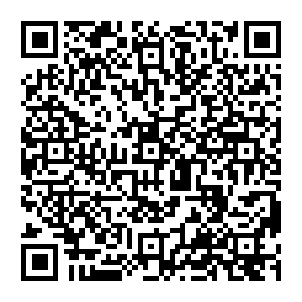

# Creating and Reading qrcode using Python
We have used pyqr code for writing qr data and pyzbar for decoding data

# Author
Dr. Noman Islam

# Demo

b'Dr. Noman Islam, PhD(CS), MS(CS), Associate Professsor, Iqra University'